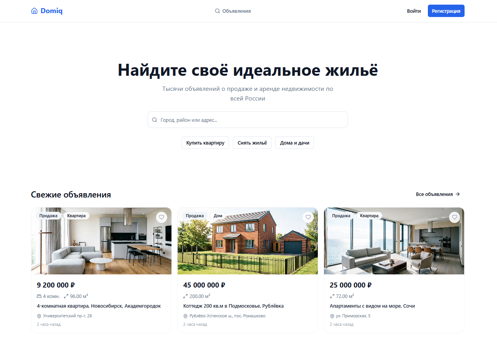

# Domiq — Маркетплейс недвижимости

Веб-приложение для поиска, продажи и аренды недвижимости по всей России.

[](https://domiq-frontend.vercel.app)



---

## Стек технологий

### Ядро
| Технология | Версия | Назначение |
|---|---|---|
| [React](https://react.dev) | 19 | UI-библиотека |
| [TypeScript](https://www.typescriptlang.org) | 5.8 | Типизация |
| [Vite](https://vitejs.dev) | 6 | Сборщик и dev-сервер |

### Стейт-менеджмент и данные
| Технология | Версия | Назначение |
|---|---|---|
| [Redux Toolkit](https://redux-toolkit.js.org) | 2.11 | Глобальное состояние (авторизация, фильтры) |
| [TanStack Query](https://tanstack.com/query/latest) | 5 | Кэш серверных данных, запросы |
| [Axios](https://axios-http.com) | 1.14 | HTTP-клиент с interceptor-ами |

### Роутинг
| Технология | Версия | Назначение |
|---|---|---|
| [React Router](https://reactrouter.com) | 7 | Клиентский роутинг, защищённые маршруты |

### UI и стили
| Технология | Версия | Назначение |
|---|---|---|
| [shadcn/ui](https://ui.shadcn.com) | latest | Готовые компоненты (Button, Dialog, Select...) |
| [Radix UI](https://www.radix-ui.com) | — | Примитивы под shadcn/ui |
| [Tailwind CSS](https://tailwindcss.com) | 4 | Утилитарные стили |
| [Lucide React](https://lucide.dev) | 0.511 | Иконки |
| [Sonner](https://sonner.emilkowal.ski) | 2 | Toast-уведомления |
| SCSS Modules | — | Сложные анимации и псевдоэлементы |

### Карты
| Технология | Версия | Назначение |
|---|---|---|
| [MapTiler SDK](https://docs.maptiler.com/sdk-js) | 4 | Интерактивные карты с маркерами объявлений |

---

## Функциональность

- Поиск и фильтрация объявлений по типу сделки, типу недвижимости, цене, площади, этажу
- Просмотр объявлений на интерактивной карте с кластеризацией по ценам
- Детальная страница объявления с галереей фото
- Авторизация и регистрация с JWT (access + refresh токены, авторефреш)
- Личный кабинет: редактирование профиля, загрузка аватара
- Избранное: добавление и управление сохранёнными объявлениями
- Создание и редактирование объявлений с drag-and-drop загрузкой фото
- Автогеокодинг адреса через MapTiler при создании объявления
- Чаты в реальном времени через WebSocket
- Панель администратора: статистика, управление пользователями, модерация объявлений
- Lazy loading страниц, skeleton-заглушки при загрузке данных

---

## Запуск локально

### Требования
- Node.js 20+
- npm

### Установка

```bash
git clone https://github.com/your-username/domiq-frontend.git
cd domiq-frontend
npm install
```

### Переменные окружения

Создайте `.env.local` в корне проекта:

```env
VITE_API_URL=http://localhost:8000/api
VITE_WS_URL=ws://localhost:8000/api
VITE_MAPTILER_KEY=your-maptiler-key
```

Ключ MapTiler можно получить бесплатно на [maptiler.com](https://www.maptiler.com).

### Разработка

```bash
npm run dev
```

Откроется на `http://localhost:5173`

### Сборка

```bash
npm run build
npm run preview
```

---

## Деплой

Проект деплоится автоматически на [Vercel](https://vercel.com) при пуше в ветку `main`.

Конфигурация SPA-редиректов — `vercel.json`.

---

## Структура проекта

```
src/
├── api/          # Axios-модули для каждого ресурса (listings, auth, chat...)
├── components/   # Переиспользуемые компоненты (ui/, layout/, listing/)
├── hooks/        # TanStack Query хуки и утилитарные хуки
├── pages/        # Страницы приложения (каждая — отдельная папка)
├── store/        # Redux store (authSlice, filtersSlice)
├── types/        # TypeScript-типы
└── utils/        # Форматирование цены, дат, текстов ошибок
```
